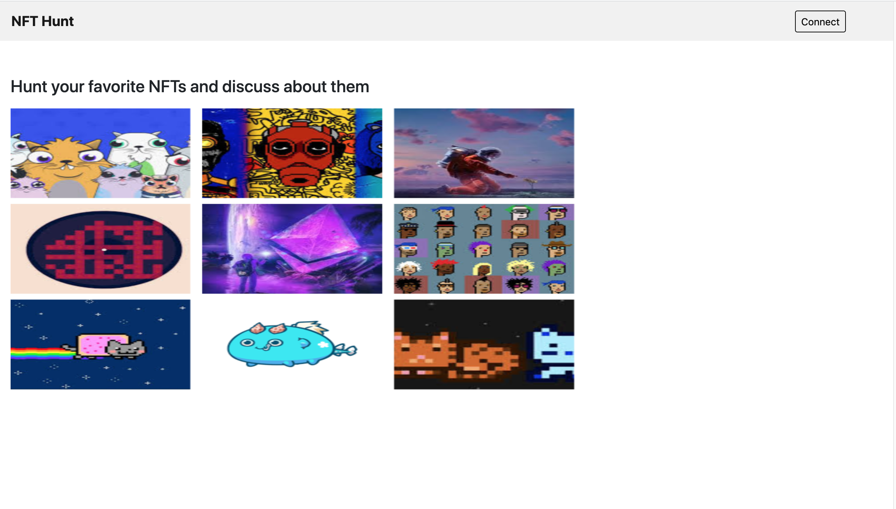
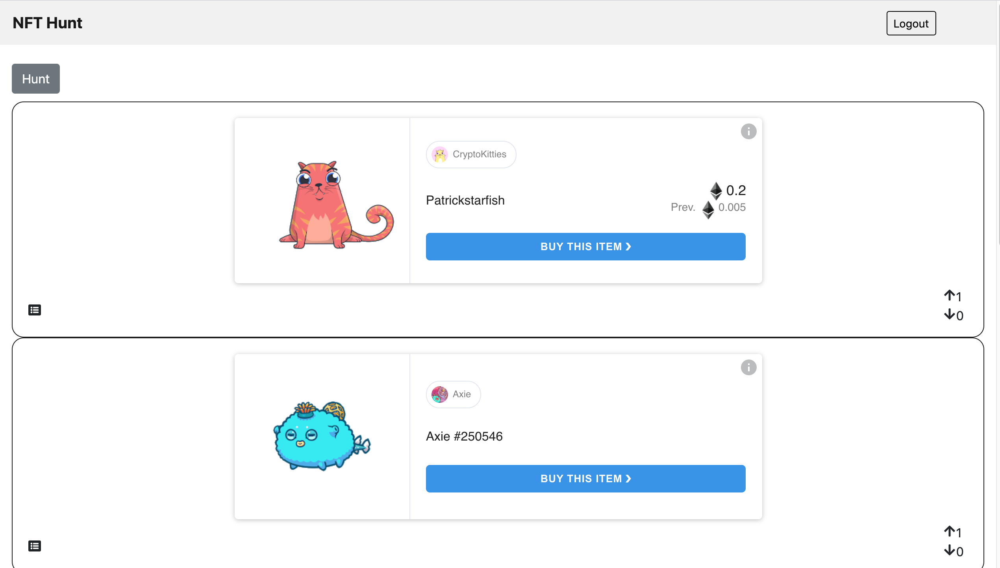
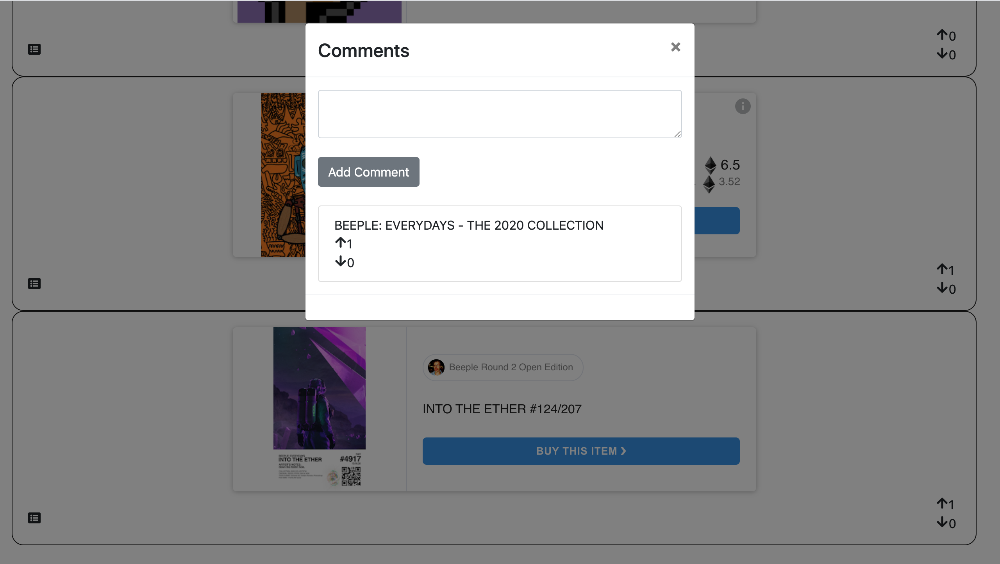
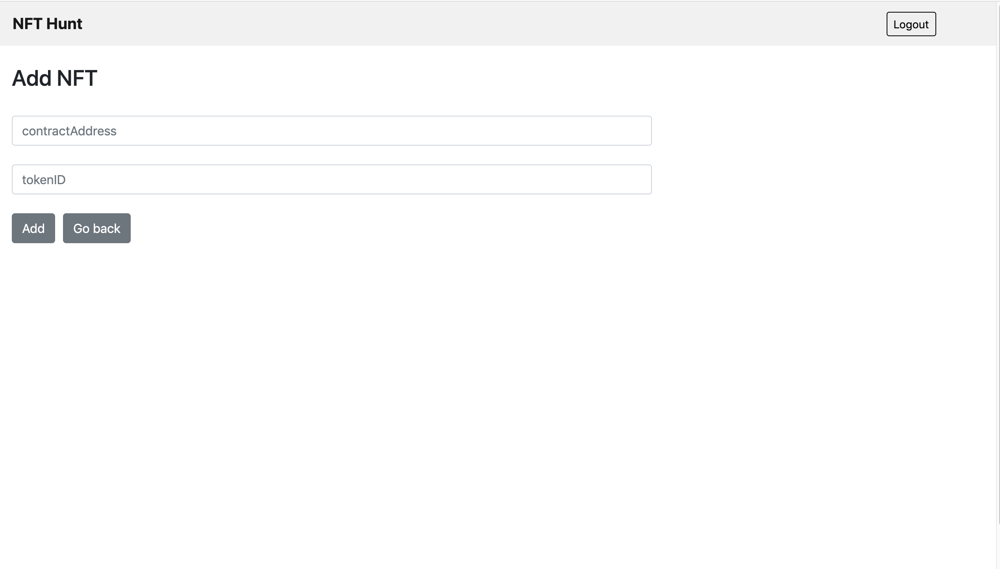

# NFT Hunt

Hunt your favorite NFTs and discuss about them

## App
https://nft-hunt.netlify.app/

## Screenshots








## Getting Started

1) Clone Repo

   ```
   git clone https://github.com/viraja1/nft_hunt.git
   ```
    
2) Change directory
    
   ```
   cd nft_hunt
   ```
   
3) Deploy the smart contract to Matic Testnet using remix IDE (contracts/NFTHunt.sol)
   
4) Update smart contract address

    Update smart contract address in client/src/components/contract.js:2
    
    ```
    vi client/src/components/contract.js
    ``` 

5) Build client app

    ```
    cd client
    npm install
    ```
    
6) Start client app

    ```
    npm start
    ```
    
7) Open client app url in chrome

    ```
    http://localhost:8080
    ```
    
8) Test the App

    Make sure that you have configured Matic Testnet using metamask 
    (https://docs.matic.network/docs/develop/metamask/testnet/)
    
    Faucet: https://faucet.matic.network/
    
                
